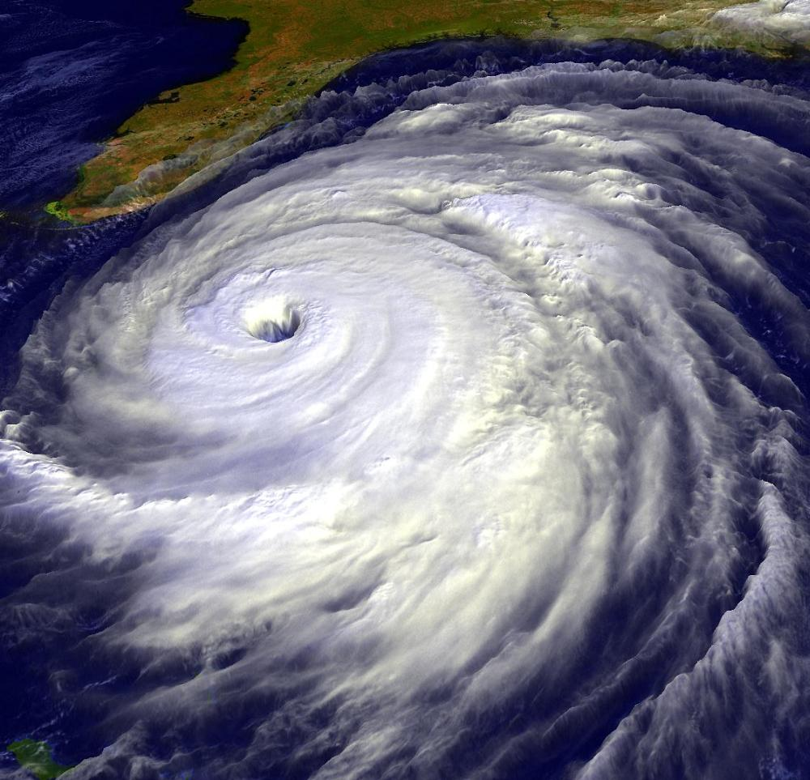
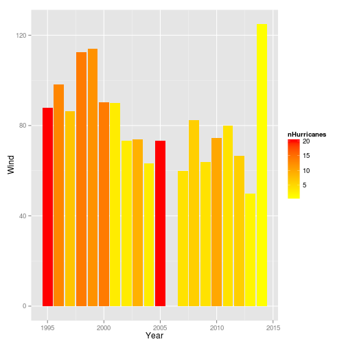
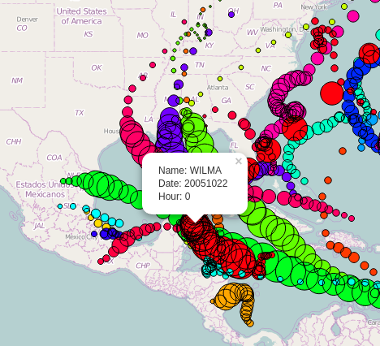

Hurricanes
========================================================
author: Irving Simonin W
date: September 28, 2015

The problem
========================================================

Every year, the hurricane season brings new challenges and even fears to those who live in high risk areas.

One of the crucial needs in every civil protection plan is prevention, which requires knowledge over past events and how to prevent and mitigate loss. 
***

Motivation
========================================================
For this reason it is important to:
* Measure the behaviour of hurricanes
* Have the data readily available
* Exploit the data

The data set
========================================================
The [hurdat2](http://www.nhc.noaa.gov/data/hurdat/hurdat2-format-atlantic.pdf)* dataset contains information of hurricanes measured in periods of 6 hours, such as:

* Wind speed
* Position
* Pressure

*You can see more on the National Hurricane Center on their [main page](http://www.nhc.noaa.gov/).

***

 

The app
========================================================
In my app you will get a feel on the hurdat2 dataset by exploring the measurments in a map.
* Different **color** means different hurricanes.
* Less **transparent** circle means newer data point.
* The **size** of the circle is proportional to wind speed.

***

